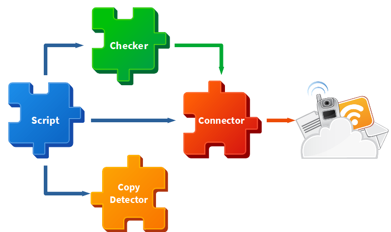

# Developer's guide
## Solution's overview
### AutoCheck.Terminal
Within the `terminal` folder you'll find the `AutoCheck.Terminal` project, which is the recommended way for a user to run the application.

### AutoCheck.Docs
Within the `docs` folder you'll find the `AutoCheck.Docs` project, where the entire project's documentation lives.

### AutoCheck.Test
Within the `test` folder you'll find the `AutoCheck.Test` project, which is used by the project maintainers in order to test the source code capabilities.

### AutoCheck.Core
Within the `core` folder you'll find the `AutoCheck.Core` project, where the entire application source code resides; the other projects uses this one as a library in order to work.

## How to use it as a library
### Download and compile
Follow this instructions in order to download and compile the application for the first time:

1. Create a folder where the application will be downloaded in.
2. Open a terminal and go into the newly crated folder.
3. Download the application with the following command: `git clone https://github.com/FherStk/AutoCheck.git`.
4. Go into the downloaded application folder and go to terminal with: `cd terminal`.
5. Build the application before using it with the following command: `dotnet build`. 

### Import the libraries
Once compiled, a set of `dll` files will be available in the `\bin\Release\net6.0` folder (recomended) or in the `\bin\Debug\net6.0` folder (the default build option), import this files into your project. 

### Call the scripts
Just create an script instance using a yaml file's path:

```
var script = new AutoCheck.Core.Script("some_yaml_file_path.yaml");
```

The script will be directly loaded and executed, sending all the output to the terminal; the script output can be requested manually and, in future releases, it will be possible to setup some output data through the yaml files.

## How to extend the application
The main purpose of this application is to automatically check the correctness for a set of assignments delivered by a group of students, so the application must be as easy as possible to use by students (to auto evaluate their own work in order to improve it and learn from the mistakes) and by teachers (to create new scripts for assisting the correction process).

All the application has been designed with a main purpose in mind: reuse and extend whatever you need. So, each component has its own role and responsibilities, detailed as follows:



### Connectors
A connector is a bridge between the application and a data source (database, file, whatever) so, a new connector can be created for communication with a new type of file or service if needed. All the connectors must inherit from `AutoCheck.Core.Connectors.Base` class and provide access to the connected source (connection string, parsed document, etc.) and any helper or auxiliary method needed for CRUD operations. 

Some complex connectors could offer a set of overloaded methods to allow more flexibility with opperations, but custom typed arguments must be avoided in order to allow interaction between a yaml script file and the connector; please, just use primitives, arrays and dictionaries as argument types for your connector methods. 

### Copy detectors
The main goal of a copy detector is to check if an student's file looks like a potential a copy of another's one. All the copy detectors must inherit from `AutoCheck.Core.CopyDetectors.Base` class and provide an implementation for their abstract methods (it will depend on every file type or content).

### Scripts
A script is a YAML file containing a set of calls to connectors in order to perform CRUD operations and validate its results. The class `AutoCheck.Core.Script` acts like a parser or interpeter for those YAML files and represents the pure AutoCheck's corem, for this reason, this class has no intended to be extended or manipulated in any way but, if you need to change some behaviour, feel free to extend it using inheritance and making `protected` the item you need to manipulate *under your own risk*. 